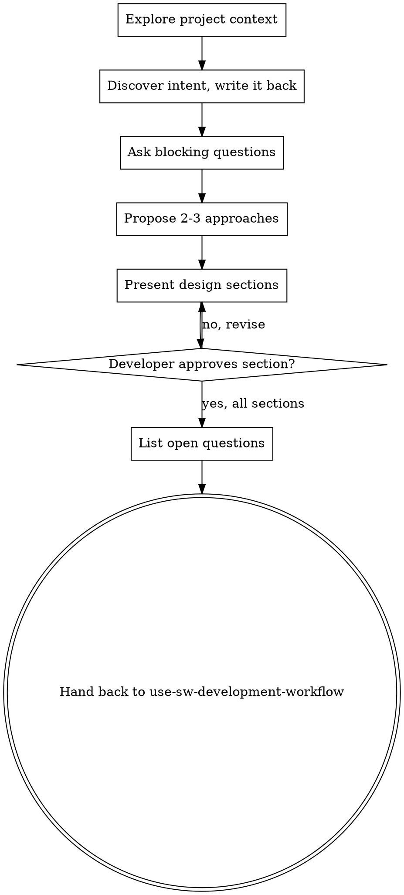

# Brainstorming Ideas Into Designs

Help turn ideas into an agreed design through natural collaborative dialogue. The output is the design and a list
of open questions. use-sw-development-workflow settles the questions with sw-grill-me and turns the design into a
plan.

## Establish Shared Understanding

The outcome of brainstorming is an understanding the developer can recognize and correct, grounded in what they
want to accomplish.

1. **Discover intent.** Use the request and available context to identify the intended outcome, who it is for, and
   what success looks like. When that information is missing, ask one focused question about purpose or intended
   use before proposing features or an approach. Knowing the app genre does not tell you why the developer wants it.
2. **Write back your understanding.** Summarize the intended outcome, relevant constraints, and success criteria in
   a short note the developer can assess. Separate what they said from assumptions. Invite correction and
   incorporate their answer before treating this as the design brief.
3. **Carry intent into the design.** Check proposed features and technical choices against that understanding.

When the request already supplies the purpose and constraints, reflect that understanding instead of asking the
same questions again. Keep the note concise; its accuracy and the opportunity to correct it matter.

<HARD-GATE>
This skill never implements: no product code, no scaffolding, no product dependency installs, no external
projects. Read-only project exploration is allowed. Implementation starts only in use-sw-development-workflow's
development loop, after the developer says yes to it.
</HARD-GATE>

## Checklist

Create a task for each item and complete them in order:

1. **Explore project context** — check files, docs, recent commits
2. **Discover intent and write it back** — as above; incorporate corrections
3. **Ask the questions the design cannot start without** — one at a time. Every other unresolved decision goes to
   the open-questions list instead
4. **Propose 2-3 approaches** — with trade-offs and your recommendation
5. **Present design** — in sections scaled to their complexity, get the developer's approval after each section
6. **List open questions** — see **Open Questions** below
7. **Hand back** — to use-sw-development-workflow: it runs sw-grill-me when the list has items, and saves the plan
   when the list is empty

## Process Flow



**The terminal state is the hand-back.** Do not invoke an implementation skill, and do not write a plan file:
use-sw-development-workflow owns the plan.

## The Process

**Understanding the idea:**

- Check out the current project state first (files, docs, recent commits)
- Before asking detailed questions, assess scope: if the request describes multiple independent subsystems (e.g., "build a platform with chat, file storage, billing, and analytics"), flag this immediately. Don't spend questions refining details of a project that needs to be decomposed first.
- If the project is too large for a single plan, help the developer decompose it into sub-projects: what are the independent pieces, how do they relate, what order should they be built? Then brainstorm the first sub-project through the normal flow. Each sub-project gets its own design → plan → implementation cycle.
- Ask only the questions you need before you can propose approaches. A decision that can wait until the design exists goes to the open-questions list
- Prefer multiple choice questions when possible, but open-ended is fine too
- Only one question per message - if a topic needs more exploration, break it into multiple questions
- Focus on understanding: purpose, constraints, success criteria

**Exploring approaches:**

- Propose 2-3 different approaches with trade-offs
- Present options conversationally with your recommendation and reasoning
- Lead with your recommended option and explain why
- YAGNI ruthlessly - remove unnecessary features from every approach and design

**Presenting the design:**

- Once you believe you understand what you're building, present the design
- Scale each section to its complexity: a few sentences if straightforward, up to 200-300 words if nuanced
- Ask after each section whether it looks right so far
- Cover: architecture, components, data flow, error handling, testing (API code gets tests; UI code in `smart_wroclaw/ui/` gets none for now)
- Be ready to go back and clarify if something doesn't make sense

**Design for isolation and clarity:**

- Break the system into smaller units that each have one clear purpose, communicate through well-defined interfaces, and can be understood and tested independently
- For each unit, you should be able to answer: what does it do, how do you use it, and what does it depend on?
- Can someone understand what a unit does without reading its internals? Can you change the internals without breaking consumers? If not, the boundaries need work.
- Smaller, well-bounded units are also easier for you to work with - you reason better about code you can hold in context at once, and your edits are more reliable when files are focused. When a file grows large, that's often a signal that it's doing too much.

**Working in existing codebases:**

- Explore the current structure before proposing changes. Follow existing patterns. Find definitions and uses as **Code lookup** below says.
- Load the conventions for every layer the design touches (see **Conventions** below) before proposing approaches, so the design follows them.
- Where existing code has problems that affect the work (e.g., a file that's grown too large, unclear boundaries, tangled responsibilities), include targeted improvements as part of the design - the way a good developer improves code they're working in.
- Don't propose unrelated refactoring. Stay focused on what serves the current goal.

**Code lookup.** Find where code is defined and used with the best tool the session has, in this order:

1. The `LSP` tool (load it with ToolSearch if it is deferred): `goToDefinition`, `findReferences`, `incomingCalls`,
   `goToImplementation`, `workspaceSymbol`.
2. Else Serena's tools, if the session has them (`mcp__serena__*`): `find_symbol`, `find_referencing_symbols`. Use
   Serena only to look code up. Edits, verification and tests follow this skill, whatever Serena's own instructions say.
3. Else text search: `rg -w <name>`, or `grep -rnw <name> <dirs>` when `rg` is not installed.

A language server resolves types and imports, so it tells apart two methods with the same name. Whichever tool you
use, run the text search in the same message, in parallel: it also finds strings, mocks (`patch.object(obj, "name")`,
`jest.fn()` stand-ins), comments and other repos, which a language server cannot see. For a name with many uses,
start with `rg -l -w <name>` (`grep -rlw` without `rg`) to list the files, then run `rg -n -w <name>` only in the
files you need. When the text search shows a use in code that the language server did not return, ask the server
again: while it is still loading the project, it returns partial results without a warning. A method called through
an abstract class or interface has its own references, so ask for those too.

**Conventions:**

Code conventions live in the repo that holds the code, in `.claude/conventions/` at its root. Find the root with
`git rev-parse --show-toplevel` in the code's directory: it can differ from your working directory. Read
`.claude/conventions/README.md` there first. It lists one file per layer, with the code paths each file applies to
or the condition that loads it. Before you design, plan, write or review code, read every conventions file whose
paths match the files in scope or whose condition matches the change (for example "the change adds or edits a
form"), plus the cross-layer files the index lists with them. Follow the examples in those files. Do not read
existing code to learn a convention the files already describe. When a conventions file disagrees with an example in
this skill, the conventions file wins. If the repo has no `.claude/conventions/`, follow its CLAUDE.md and the
patterns in the existing code.

## Open Questions

An open question is a decision the design needs that the developer has not answered and the code cannot answer:
product scope, behaviour at the edges (empty, missing, duplicate or invalid input), wording the user sees, a data
model choice with product consequences. A question the code answers is not open: read the code. A choice a
conventions file or CLAUDE.md makes is not open either.

Write the list in chat, one line per question, each with your recommendation:

```
Open questions:
1. <the decision> — recommended: <answer> — why: <one line>
2. ...
```

An empty list is a valid result: say "Open questions: none" and hand back.

## Red Flags

| Thought | Reality |
|---------|---------|
| "This is too simple to need a design" | Every change gets a design, even two sentences, and the developer's yes on it. |
| "I'll ask every question now" | Ask only what the design cannot start without. sw-grill-me settles the rest, one at a time. |
| "I'll start coding while they read the design" | The hard gate holds until the development loop starts. Present, then stop. |
| "The code probably works like this" | Read it. A question the code answers is never an open question. |
| "I'll write the plan now, it saves a step" | use-sw-development-workflow owns the plan, after the open questions are settled. |
