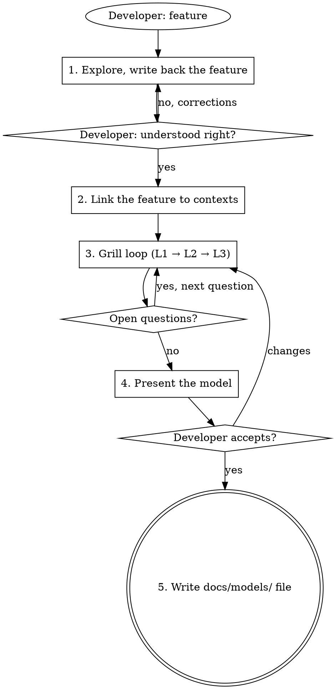

# SW Domain Modeling

## Overview

The developer describes a feature. You agree with them on what the feature is, then find the models it needs by
asking one question at a time, guided by DDD and event storming, until the model fits the feature and the developer
has made every choice knowing its pros and cons. The result is one file: `docs/models/<yyyy-mm-dd>-<model-name>.md`.

**This skill ends at the model.** Endpoints, UI, tasks and tests belong to use-sw-development-workflow, which can
take the model file as input later. Do not announce or run that workflow here, and do not write a plan.

<HARD-GATE>
No product code, tables, migrations or plans. Read-only exploration, then the one model file after the developer's
yes. The file stays uncommitted.
</HARD-GATE>

**Announce at start:** "I'm using sw-domain-modeling."

## The Flow



Create a todo per step and complete them in order.

## 1. Explore and Confirm the Feature

The understanding the developer confirms here is the base of every later question.

**Explore.** From the repo root (`git rev-parse --show-toplevel`), read every bounded context in
`api/api/contexts_boundaries/*_bc/`:

- its models: `models.py` or `models/` (Pydantic classes and enums)
- its tables: `repositories/tables/*.py`, where the `CREATE TABLE` comment is the schema
- the migrations in `api/api/adapters/db/migrations/versions/`
- earlier model files in `docs/models/`

Read further, into services, routers or `ui/`, only where the feature already shows up. When `docs/db_er.mmd`
disagrees with the code, the code wins.

**Write back.** Send your understanding in this shape:

```
How I understand the feature:
- What it does: <the behaviour, in the developer's words>
- Who uses it: <actors>
- What already exists: <models, fields or flows in the repo that already serve it>
- Not part of it: <what you take to be out of scope>

You said: <the facts from the developer>
I assume: <everything else>

Is this right?
```

"I assume" covers what the feature is: its scope, its actors, what its words mean. Model choices (one or many,
uniqueness, who owns what) are not assumptions: they become questions in step 3.

**Iterate.** A correction: rewrite the whole understanding with it and ask again. Go to step 2 only after the
developer says it is right. When a later answer or change alters this understanding, rewrite it, get a yes, then
continue where you were.

## 2. Link the Feature to Contexts

Show the developer how the confirmed feature touches each context:

```
| Context | Link | Why |
| city_events_bc | extends CityEvent | <one line> |
| auth_bc | references User by id | <one line> |
| chat_bc | untouched | <one line> |
New context: <none | <name>_bc, because ...>
```

Link is one of: extends, references by id, reacts to its events, untouched. A link you are unsure of becomes an
open question for step 3. Send the table in the same message as the first question of step 3. A correction to the
table is handled like a change in step 4.

## 3. Grill Loop

**REQUIRED SUB-SKILL:** sw-grill-me, with the changes in **Using sw-grill-me**. Walk the lenses in order, because
each lens's answers shape the next. Skip a lens that has nothing to decide for this feature.

| Lens | Asks | Fixes in the model |
|------|------|--------------------|
| **L1 Events** | What happens, who causes it, which states does it move through? | Models, fields, status values, which changes need history |
| **L2 Rules** | What must always be true: one or many, uniqueness, what changes together, what happens on delete? | Aggregate boundary, relations and cardinality, constraints |
| **L3 Boundaries** | Which context owns each model? Does it link to others by id or react to their events? | Where each model lives and how it connects |

Two rules hold in every lens:

- Name models and fields with the developer's words.
- A question the code answers is not asked. Read the code.

Questions stay on the model. Endpoints, UI, background jobs and tests are not asked here.

**Every question uses this template, one question per message:**

```
**Q<n> · L<k> <lens>: <the decision>**

**O1. <option>**
- Pros: <the one or two that matter most>
- Cons: <the one or two that matter most>

**O2. <option>**
- Pros: ...
- Cons: ...

Recommended: O<x>, because <one line>.
```

Two or three options. Pros and cons are about this repo and this feature, not textbook trade-offs.

## 4. Present the Model

When no question is open, present the model in this shape, then ask: "Accept this model, or tell me what to change?"

```
# <Model name>

## What and why
<what the model is, and why it has this shape, in a few sentences>

## Connections to existing models
- <context>.<Model>.<field>: <how the new model uses it>

## Pseudocode
<Pydantic BaseModel classes and StrEnums as in the repo's models.py: one class per new model;
for a changed model, only the new or changed fields, with "# existing fields unchanged">

## Decisions
- <question> → <the developer's answer> (rejected: <other options>)
```

**When the developer asks for changes,** each change becomes a question in step 3, ordered by lens like any other:
O1 is the current choice, O2 the requested change, O3 a variant when one fixes a flaw in the request, each with pros
and cons, and your recommendation. Ask the follow-up questions the change opens. An answer that overturns a
decision replaces its Decisions line, and the old answer moves to "rejected". Then present the whole model again. "Change X, then save it" is a request for changes: save only after a yes on the
model as it now stands.

## 5. Write the Model File

After the developer's yes, write the step 4 output exactly as presented to
`docs/models/<yyyy-mm-dd>-<model-name>.md` at the repo root: today's date, the model name in kebab-case. Create
`docs/models/` if it is missing. Do not commit. Reply with the path, and stop.

## Using sw-brainstorming

Use only "Ask the questions the design cannot start without" and "Propose 2-3 approaches", when a question has more
than one sound answer. Approaches use the question template above. Step 1 here replaces its "Discover intent and
write it back". Skip its design sections (architecture, data flow, error handling, testing) and its hand-back to
use-sw-development-workflow: its open questions go to step 3 here.

## Using sw-grill-me

- Start from the open questions of steps 2 and 3, ordered L1 → L2 → L3. Within a lens, ask first the questions
  whose answers change other questions.
- Every question uses the question template above.
- Record each answer for the Decisions section as `- <question> → <answer> (rejected: <options>)`, in the
  developer's words. When they accept your recommendation, write the recommendation.
- When the list is empty and no follow-up is open, go to step 4 here, not to use-sw-development-workflow.

## Red Flags

| Thought | Reality |
|---------|---------|
| "The feature is clear, I'll skip the write-back" | Every later question builds on the confirmed understanding. Write it back and wait for the yes. |
| "I'll design the endpoints, UI and tests too" | This skill ends at the model. The workflow takes the file later. |
| "I'll save the plan to docs/plans/" | The only file is `docs/models/<date>-<name>.md`. There is no plan. |
| "This trade-off is obvious, I'll skip pros and cons" | Every option gets pros and cons. The developer decides with them. |
| "The developer asked for it, I'll just apply the change" | Show it against the current choice with pros and cons, ask, then present the model again. |
| "They said 'then save it'" | Save only after a yes on the model as it now stands. |
| "I'll ask about all three lenses at once" | One question per message, L1 before L2 before L3. |
