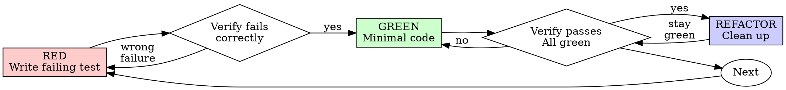

# Test-Driven Development (TDD)

## Overview

Write the test first. Watch it fail. Write minimal code to pass.

**Core principle:** If you didn't watch the test fail, you don't know if it tests the right thing.

**Violating the letter of the rules is violating the spirit of the rules.**

## Roles in use-sw-development-workflow

The cycle below is split between two agents:

- **The lead** writes the failing test and watches it fail (RED). It never writes the implementation.
- **The engineer** (sw-run-with-engineer) writes the minimal code that makes that test pass (GREEN) and refactors.
  It never edits the lead's test. If it believes the test is wrong, it stops and reports why to the lead.
- **The lead** then validates: it re-runs the test and the suite itself.

Outside the workflow, one agent runs the whole cycle. A UI task has no RED step: the engineer builds the behaviour
and the lead checks it with the UI's lint and build.

## When to Use

**Always:**
- New features
- Bug fixes
- Refactoring
- Behavior changes

**Not for UI code, for now:** code in `smart_wroclaw/ui/` has no test setup, so UI changes get no tests. The UI's
lint and build check them (use-sw-development-workflow). API code in `smart_wroclaw/api/` always follows this skill.

**Exceptions (ask the developer; an engineer reports them to the lead instead):**
- Throwaway prototypes
- Generated code
- Configuration files

Thinking "skip TDD just this once"? Stop. That's rationalization.

## The Iron Law

```
NO PRODUCTION CODE WITHOUT A FAILING TEST FIRST
```

Write code before the test? Delete it. Start over.

**No exceptions:**
- Don't keep it as "reference"
- Don't "adapt" it while writing tests
- Don't look at it
- Delete means delete

Implement fresh from tests. Period.

## Red-Green-Refactor



### RED - Write Failing Test

Write one minimal test showing what should happen.

<Good>
```typescript
test('retries failed operations 3 times', async () => {
  let attempts = 0;
  const operation = () => {
    attempts++;
    if (attempts < 3) throw new Error('fail');
    return 'success';
  };

  const result = await retryOperation(operation);

  expect(result).toBe('success');
  expect(attempts).toBe(3);
});
```
Clear name, tests real behavior, one thing
</Good>

<Bad>
```typescript
test('retry works', async () => {
  const mock = jest.fn()
    .mockRejectedValueOnce(new Error())
    .mockRejectedValueOnce(new Error())
    .mockResolvedValueOnce('success');
  await retryOperation(mock);
  expect(mock).toHaveBeenCalledTimes(3);
});
```
Vague name, tests mock not code
</Bad>

**Requirements:**
- One behavior
- Clear name
- Real code (no mocks unless unavoidable)

### Verify RED - Watch It Fail

**MANDATORY. Never skip.**

```bash
npm test path/to/test.test.ts
```

Confirm:
- Test fails (not errors)
- Failure message is expected
- Fails because feature missing (not typos)

**Test passes?** You're testing existing behavior. Fix test.

**Test errors?** Fix error, re-run until it fails correctly.

### GREEN - Minimal Code

Write simplest code to pass the test.

<Good>
```typescript
async function retryOperation<T>(fn: () => Promise<T>): Promise<T> {
  for (let i = 0; i < 3; i++) {
    try {
      return await fn();
    } catch (e) {
      if (i === 2) throw e;
    }
  }
  throw new Error('unreachable');
}
```
Just enough to pass
</Good>

<Bad>
```typescript
async function retryOperation<T>(
  fn: () => Promise<T>,
  options?: {
    maxRetries?: number;
    backoff?: 'linear' | 'exponential';
    onRetry?: (attempt: number) => void;
  }
): Promise<T> {
  // YAGNI
}
```
Over-engineered
</Bad>

Don't add features, refactor other code, or "improve" beyond the test.

### Verify GREEN - Watch It Pass

**MANDATORY.**

```bash
npm test path/to/test.test.ts
```

Confirm:
- Test passes
- Other tests still pass
- Output pristine (no errors, warnings)

**Test fails?** Fix code, not test.

**Other tests fail?** Fix now.

**"Other tests" means the project's suite, not just your file.** A
green run of the test you wrote is not a green suite. Before you call
the change done, run the project's test command (bare `pytest`,
`npm test`, `cargo test` — whatever the repo uses) even when your task
named only one test file. A scope statement in your task bounds the
deliverable, not your verification. Any failure that run shows —
including one you didn't cause — goes in your report by name; a red
test you watched scroll past and didn't mention is a report falsified
by omission.

### REFACTOR - Clean Up

After green only:
- Remove duplication
- Improve names
- Extract helpers

Keep tests green. Don't add behavior.

### Repeat

Next failing test for next feature.

## Good Tests

| Quality | Good | Bad |
|---------|------|-----|
| **Minimal** | One thing. "and" in name? Split it. | `test('validates email and domain and whitespace')` |
| **Clear** | Name describes behavior | `test('test1')` |
| **Shows intent** | Demonstrates desired API | Obscures what code should do |

When writing or changing any test, read [writing-good-tests.md](writing-good-tests.md) for the rules that keep tests honest:
- Name the production change that would make the test fail — before writing it
- Assert on real behavior, never on mock behavior
- Keep test-only code in test utilities, out of production classes
- Understand a dependency's side effects before mocking it

## Test Conventions

TDD tells you the process (red-green-refactor). The repo's test conventions tell you the patterns (base classes,
factories, mocks, assertions, test commands). Load them before writing the first test.

Code conventions live in the repo that holds the code, in `.claude/conventions/` at its root. Find the root with
`git rev-parse --show-toplevel` in the code's directory: it can differ from your working directory. Read
`.claude/conventions/README.md` there first. It lists one file per layer, with the code paths each file applies to
or the condition that loads it. Before you design, plan, write or review code, read every conventions file whose
paths match the files in scope or whose condition matches the change (for example "the change adds or edits a
form"), plus the cross-layer files the index lists with them. Follow the examples in those files. Do not read
existing code to learn a convention the files already describe. When a conventions file disagrees with an example in
this skill, the conventions file wins. If the repo has no `.claude/conventions/`, follow its CLAUDE.md and the
patterns in the existing code.

The test files you write are in scope: load the conventions for the test type (for example unit, integration,
component) as well as for the code under test.

## Running Tests

Run tests with the repo's test commands: its CLAUDE.md, then the root files of the project that holds the code
(`package.json` scripts, `pyproject.toml`, `Makefile`, pre-commit config). Never run a command the repo marks as
unsafe.

After GREEN and after REFACTOR, run the project's format, lint and type-check commands on what you changed, found the
same way, and fix every failure before the next test.

A command that can outlast the Bash time limit, such as a full suite, runs in the background. Wait for it in the same
turn, and never end your turn while a command you started is still running.

**Comments.** Make the code explain itself first: clear names, small functions, precise types. Add a comment only
where the code cannot explain itself, such as a constraint, a non-obvious reason or a workaround, and say why, not
what the code does. Keep existing comments that still hold. Fix or delete a comment your change made wrong.

Never commit, stage or push. The developer reviews the work and commits it.

## Common Rationalizations

| Excuse | Reality |
|--------|---------|
| "Too simple to test" | Simple code breaks. Test takes 30 seconds. |
| "I'll test after" | Tests written after pass immediately — which proves nothing. They may test the wrong thing, test the implementation instead of the behavior, or miss the edge case you forgot. You never watched it fail, so you never proved it can catch the bug. Test-first forces that failure. |
| "Tests after achieve same goals (spirit not ritual)" | Tests-after answer "what does this do?"; tests-first answer "what should this do?" Tests written after are biased by the code you already wrote — you verify the cases you remembered, not the ones you'd have discovered. Coverage without proof the tests work. |
| "Already manually tested" | Manual testing is ad-hoc: no record of what you covered, no way to re-run it when the code changes, easy to forget cases under pressure. "Worked when I tried it" ≠ comprehensive. Automated tests run the same way every time. |
| "Deleting X hours is wasteful" | Sunk cost fallacy — that time is already spent either way. The real choice: rewrite with TDD (high confidence) vs. keep it and bolt tests on after (low confidence, likely bugs). Keeping code you can't trust is the waste. |
| "Keep as reference, write tests first" | You'll adapt it. That's testing after. Delete means delete. |
| "Need to explore first" | Fine. Throw away exploration, start with TDD. |
| "Test hard = design unclear" | Listen to test. Hard to test = hard to use. |
| "TDD will slow me down" | TDD IS the pragmatic path: catches bugs before commit, prevents regressions, lets you refactor without fear. "Pragmatic" shortcuts mean debugging in production — slower, not faster. |
| "Manual test faster" | Manual doesn't prove edge cases. You'll re-test every change. |
| "Existing code has no tests" | You're improving it. Add tests for existing code. |

## Red Flags - STOP and Start Over

- Code before test
- Test after implementation
- Test passes immediately
- Can't explain why test failed
- Tests added "later"
- Rationalizing "just this once"
- "I already manually tested it"
- "Tests after achieve the same purpose"
- "It's about spirit not ritual"
- "Keep as reference" or "adapt existing code"
- "Already spent X hours, deleting is wasteful"
- "TDD is dogmatic, I'm being pragmatic"
- "This is different because..."

**All of these mean: Delete code. Start over with TDD.**

## Example: Bug Fix

**Bug:** Empty email accepted

**RED**
```typescript
test('rejects empty email', async () => {
  const result = await submitForm({ email: '' });
  expect(result.error).toBe('Email required');
});
```

**Verify RED**
```bash
$ npm test
FAIL: expected 'Email required', got undefined
```

**GREEN**
```typescript
function submitForm(data: FormData) {
  if (!data.email?.trim()) {
    return { error: 'Email required' };
  }
  // ...
}
```

**Verify GREEN**
```bash
$ npm test
PASS
```

**REFACTOR**
Extract validation for multiple fields if needed.

## Verification Checklist

Before marking work complete:

- [ ] Every new function/method has a test
- [ ] Watched each test fail before implementing
- [ ] Each test failed for expected reason (feature missing, not typo)
- [ ] Wrote minimal code to pass each test
- [ ] All tests pass
- [ ] Output pristine (no errors, warnings)
- [ ] Tests use real code (mocks only if unavoidable)
- [ ] Edge cases and errors covered

Can't check all boxes? You skipped TDD. Start over.

## When Stuck

| Problem | Solution |
|---------|----------|
| Don't know how to test | Write wished-for API. Write assertion first. Ask the developer (an engineer asks the lead). |
| Test too complicated | Design too complicated. Simplify interface. |
| Must mock everything | Code too coupled. Use dependency injection. |
| Test setup huge | Extract helpers. Still complex? Simplify design. |

## Debugging Integration

Bug found? Write failing test reproducing it. Follow TDD cycle. Test proves fix and prevents regression.

Never fix bugs without a test.

## Final Rule

```
Production code → test exists and failed first
Otherwise → not TDD
```

No exceptions without the developer's permission.
