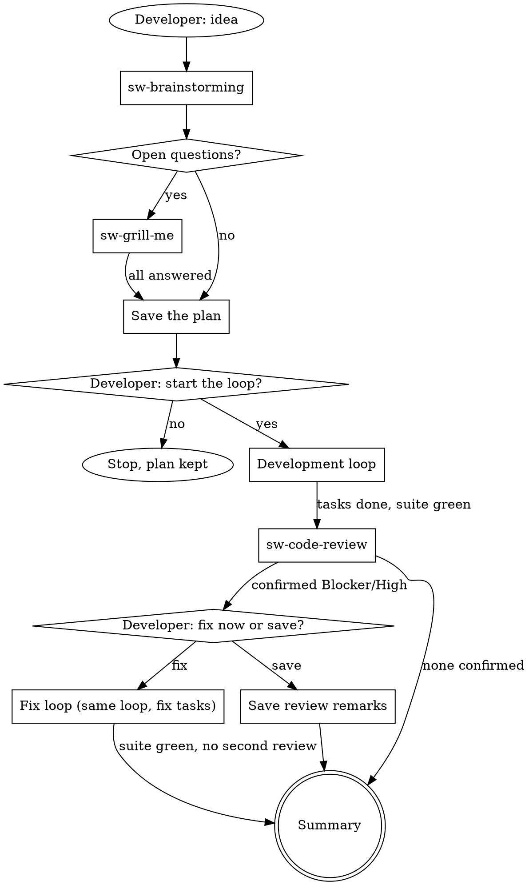

# SW Development Workflow

## Overview

One flow built from the sw- skills. The developer shapes the work (sw-brainstorming, sw-grill-me). The lead builds
it task by task: for API tasks it writes each failing test and an engineer subagent makes it pass
(sw-test-driven-development, sw-run-with-engineer); UI tasks have no tests for now. The lead validates every task. A separate agent reviews the result (sw-code-review), and the
developer decides what happens to the findings.

**The main session is the lead.** Subagents cannot talk to the developer. Every question to the developer and every
decision point happens in this session.

**State lives in the plan file, not in conversation memory.** Compaction summaries lose phases and invent next
steps. Before each phase, re-derive where you are from the plan (its task checkboxes, `Base:`, `Review:` and Review
remarks) and from `git status`.

**Agents never commit, stage or push.** The developer reviews the work and commits it.

**Announce at start:** "I'm using the sw development workflow."

## The Flow



## Phases

Create a todo per phase and complete them in order:

1. **Brainstorm** — **REQUIRED SUB-SKILL:** sw-brainstorming. It ends with an agreed design and a list of open
   questions.
2. **Settle open questions** — when the list has items, **REQUIRED SUB-SKILL:** sw-grill-me on that list. Skip this
   phase when the list is empty.
3. **Save the plan** — write the plan file (see **The Plan File**) to `docs/plans/YYYY-MM-DD-<topic>.md` at the repo
   root (`git rev-parse --show-toplevel`). Goal and Design come from sw-brainstorming, Decisions from sw-grill-me. Leave
   it uncommitted: the developer reviews and commits.
4. **Ask to start** — show the plan's path and its task list, and ask: "Start the development loop?" No: stop. The
   plan stays for a later session. Yes: phase 5.
5. **Development loop** — see **The Loop**.
6. **Review** — **REQUIRED SUB-SKILL:** sw-code-review. It dispatches the reviewer, revalidates the Blocker and
   High findings, saves Medium and Low to Review remarks, and asks the developer to fix the confirmed findings now
   or save them. When the developer chooses to fix, sw-code-review adds the fix tasks to the plan: run **The Loop**
   again on them. The fix loop gets no second review: an API fix is proven by a test that failed before it, a UI
   fix by your read of the diff and the UI's lint and build.
7. **Summary** — your final message: tasks done, decisions the developer took during the build, findings fixed and
   saved (by F-id), files changed (`git status --short`), and the results of the last API suite run and UI lint and
   build. Say that nothing is committed.

## Resuming

When the developer points to an existing plan, or a new session finds one for this work, read it and resume at the
earliest unfinished phase:

- unchecked tasks → phase 5, at the first unchecked task
- all tasks checked and `Review: not yet` → phase 6
- a `Review:` date, unchecked items in Review remarks, and no unchecked tasks → ask the developer whether to fix
  the remarks now. The remarks they name become fix tasks, as sw-code-review step 6 writes them, then phase 5.

## The Plan File

```markdown
# <Feature> Plan

**Goal:** <one sentence>
**Design:** <the approach agreed in sw-brainstorming, a few lines: components, data flow, error handling, testing>
**Base:** <set when the development loop first starts>
**Review:** not yet

## Decisions

- <question> → <developer's answer>

## Tasks

- [ ] 1. <API behaviour> · files: <paths> · tests: <cases that prove it, with their exact values>
- [ ] 2. <UI behaviour> · files: <paths> · tests: none (UI)

## Review remarks
```

Split the design into tasks:

- A task is one behaviour, and ends with a deliverable you can check on its own.
- **API code (`smart_wroclaw/api/`) always gets tests.** Name the exact files and the test cases, with the values the
  test asserts. You write each test from that line.
- **UI code (`smart_wroclaw/ui/`) gets no tests for now:** the UI has no test setup. Its task line says
  `tests: none (UI)`, and the UI's lint and build check it (`next build` also type-checks).
- Keep a feature's API and UI changes in separate tasks, the API task first, so each task has one kind of check.
- Fold setup, configuration and scaffolding into the task whose deliverable needs them.
- Order the tasks so each one builds only on tasks before it.

## The Loop

Before the first task:

- **REQUIRED SUB-SKILL:** load sw-test-driven-development and sw-run-with-engineer.
- When the plan's `Base:` is empty, set it to the output of `git rev-parse HEAD`. Never change it afterwards:
  sw-code-review diffs from it.
- Find the test and check commands for each project the plan touches: the repo's CLAUDE.md, then the root files of
  that project (`package.json` scripts, `pyproject.toml`, `Makefile`, pre-commit config).

For each unchecked task, in order, without pausing between tasks:

1. **Take the task.** Read its line in the plan, the Decisions that touch it, and the files it names. Mark its
   todo in progress.
2. **RED — you, API tasks only.** Write the task's failing test from its test cases, under
   sw-test-driven-development. Run it and read the output: it must fail because the behaviour is missing, not
   because of a typo or an import error. A test that passes before the implementation exists is a finding about the
   test: fix the test. A UI task (`tests: none (UI)`) skips this step.
3. **GREEN — the engineer.** Delegate with sw-run-with-engineer: the task, the failing test (path, name, command and
   the failing output) or, for a UI task, the behaviour to build, the files to change, and the Decisions that touch
   it.
4. **Validate — you.** sw-run-with-engineer's step 3. API task: read the diff, check that the test was not edited,
   and re-run the test, the API suite and its checks yourself. UI task: read the diff and run the UI's lint and build
   yourself.
5. **Tick the task.** Change its `- [ ]` to `- [x]` in the plan, only after your own run passed in this session:
   the tests for an API task, lint and build for a UI task.

After the last task, run the full API test suite, and the UI's lint and build when the plan touched the UI. Long
output goes to a file; read its tail. A failure is fixed before the review: send it to the engineer as a correction
for the task that caused it, or ask the developer when no task did.

## Questions During the Build

A question comes from the engineer's report or from your own work. Route it:

- **The code, the plan or its Decisions answer it** → answer it yourself and send the answer to the same engineer
  with SendMessage.
- **Nothing answers it** (product scope, behaviour the design does not cover, wording users see, a data model
  choice) → stop the loop. Ask the developer with your recommendation and wait. Add
  `- Task <N>: <question> → <their answer>` to Decisions before the engineer continues.

The loop also stops when the engineer has failed the same correction twice (ask the developer how to proceed, with
your recommendation), and before any destructive or irreversible action: deleting data, resetting a database, a push.

## Developer Decision Points — Never Skip

- The design, section by section (phase 1)
- The open questions (phase 2)
- Starting the loop (phase 4)
- A question during the build that nothing answers
- Fix now or save, after the review (phase 6)

Questions the code, the plan or its Decisions answer are yours: explore instead of asking.

## Red Flags — STOP

| Excuse | Reality |
|--------|---------|
| "Too simple for the workflow" | A small change gets a short design and a one-task plan, not zero decision points. |
| "The design is agreed, I'll start the loop" | Phase 4 asks first. Starting is the developer's decision. |
| "I'll let the engineer write the test too" | You write the failing test, so the engineer never writes the test it must pass. |
| "I'll add a test for this UI change" | UI code gets no tests for now. Lint and build check it. |
| "The engineer says the tests pass" | A report is a claim. Re-run them yourself before you tick the task. |
| "I'll decide this product question myself" | Code questions are yours. Product, scope and behaviour decisions are the developer's; give a recommendation. |
| "The summary says the next step is task 4" | Summaries invent next steps. Read the plan's checkboxes and `git status`. |
| "The review found little, skip revalidation" | sw-code-review revalidates every Blocker and High before the developer sees it. |
