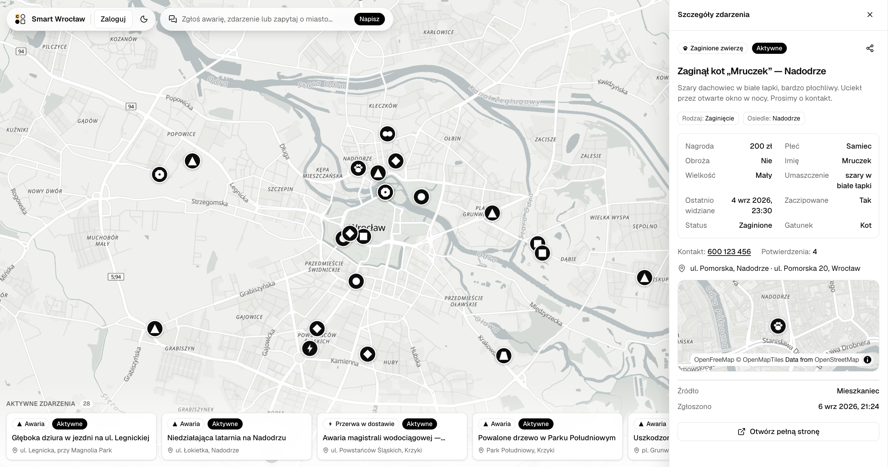

<div align="center">

### 🌐 Language / Język

<kbd>🇬🇧 &nbsp;<b>English</b> ✓&nbsp;</kbd> &nbsp;&nbsp; <kbd>🇵🇱 &nbsp;<a href="README.pl.md"><b>Polski</b></a>&nbsp;</kbd>

</div>

---

# Smart Wrocław

<div align="center">



**Smart Wrocław — the citizen application.**

</div>

## Part of PROGRAM AI 2030

[](https://app.imprv.ai/goal_package/5f9e6bc2-7b4b-47a1-90b4-d905796719c0)

> This project is part of **[PROGRAM AI 2030](https://app.imprv.ai/goal_package/5f9e6bc2-7b4b-47a1-90b4-d905796719c0)** — a set of hands-on courses in which we build **28 projects, each powered by many AI and ML algorithms** to solve a real business problem. **Smart Wrocław** is one of the applications built along the way.
>
> In particular, this project belongs to the course **_"Od hobbystycznego budowniczego AI do profesjonalisty"_** (*"From hobbyist AI builder to professional"*) — the program's opening course.
>
> 👉 **Explore the program: [app.imprv.ai](https://app.imprv.ai/goal_package/5f9e6bc2-7b4b-47a1-90b4-d905796719c0)**

[](https://app.imprv.ai/goal_package/5f9e6bc2-7b4b-47a1-90b4-d905796719c0)

A citizen app for the city of **Wrocław**.

## Run it (Dev Container — recommended)

A one-click, reproducible environment. Python 3.12, Poetry, Node 20, pnpm,
Postgres and the Inngest dev server all come up as a Compose stack — identically
on **macOS, Windows (WSL2) and Linux**. All you need is **Docker** and an editor
with Dev Containers support (VS Code + the *Dev Containers* extension, or the
`devcontainer` CLI). No local Python/Node/Postgres install.

### 1. Open in the container

1. Open this folder in VS Code.
2. **Reopen in Container** (Command Palette → *Dev Containers: Reopen in
   Container*). The first build takes a few minutes; `postCreate.sh` then installs
   the backend + frontend deps and applies the DB migrations, and prints
   **"Devcontainer ready"**.

### 2. Start the stack — three terminals

Open three terminals **inside the container** (VS Code → *Terminal*). In each one,
activate the project virtualenv first with **`penv`** (an alias for
`source .venv/bin/activate`), then run the pipeline:

```bash
# Terminal 1 — backend: REST API + Inngest worker (role=all) on :8101
penv
pypyr start_be

# Terminal 2 — load the demo city-events dataset (one-off; see note)
penv
pypyr seed_events

# Terminal 3 — Next.js UI on :3100
penv
pypyr start_ui
```

> `pypyr seed_events` appends the demo events to the database, so run it **once** —
> re-running it duplicates the rows. Skip it if you already have data.

`penv`, `pypyr` and the pipelines come preconfigured in the container — no extra
setup. Inside the container always use **`pypyr start_be`** (not `start_api` /
`start_worker` / `start_tilt`): those target the native host stack and break chat
turns when run in the container.

### 3. Open it

Open the forwarded ports (VS Code → **Ports** panel):

| Service      | URL                        |
|--------------|----------------------------|
| UI           | http://localhost:3100      |
| API + docs   | http://localhost:8101/docs |
| Inngest      | http://localhost:8288      |

Full details, gotchas and the native (non-container) workflow:
[`.devcontainer/README.md`](.devcontainer/README.md).

## Layout

```
smart_wroclaw/            ← project root: Poetry (pyproject.toml, poetry.lock, .venv)
├── api/      FastAPI · pypika · Inngest — backend service (see api/README.md)
│   └── api/ai/<agent>/   each AI agent: versions/ · datasets/ · eval/ (its own scored loop)
├── ui/       Next.js · React · Tailwind v4 · shadcn/ui · TanStack Query (see ui/README.md)
├── dev/      pypyr task pipelines that orchestrate the stack (native workflow)
├── .annotator/  lightweight in-repo dataset annotator (see .annotator/README.md)
├── docs/     architecture notes + diagrams
└── compose.yaml · Tiltfile · Dockerfile   ← infra / runtime
```

The architecture mirrors the sibling `imprv-ai-service` / `imprv-api` services:
bounded contexts, layered repositories/services, a pypika `DBClient`, an API/worker
split, and Inngest for background jobs.

## License

Smart Wrocław is **source-available** under the
[PolyForm Noncommercial License 1.0.0](LICENSE).

- ✅ You may **use, run, study, modify, and share** it — including your changes —
  for any **noncommercial** purpose, free of charge.
- ⛔ **Commercial use is not permitted** under this license — in whole or in part.
- 🤝 **Commercial use** is available **only with prior written approval** of the
  authors and **Improved AI**. To request a commercial license, contact Improved
  AI at [imprv.ai](https://imprv.ai).

See the [`LICENSE`](LICENSE) file for the full terms.

Required Notice: Copyright Improved AI (https://imprv.ai)
